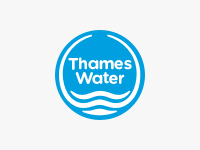

It's a little tricky to create a portfolio of development work I've been involved in. It can't always be portrayed with shiny screenshots or cool UX prototypes and behind-the-scenes photos of spint meetings.

So rather than a traditional portfolio, here are some details of some of the larger projects I've been involved in.

## Air BP - Airfield Automation

Air BP tracks the movement of airline fuel throughout its journey from the ground, to refineries and storage tanks, and finally to airlines. The Airfield Automation project was to convert an antiquated Windows desktop application into a versitile web application for use on any platform including mobile devices.

### My role:

Using the exiting desktop application as a starting point and utilising Air BP's brand guidelines, I designed the UI for the updated forms. I translated these designs into React components which the team could then use to build the necessary steps of the form.

**Tech stack:** React.js, Bootstrap, Sass, Gulp, Sketch

## Thames Water - Developer Services

The project was to build a multi-step form for property developers to book in new water connections — a process which was formerly paper-based and involved a large amount of human input. The form contains a large amount of logic and validations which are checked against and API provided by a Sitecore and SAP backend.

### My role:

My role was to design and build the static frontend templates of the form which were later ported over to a Sitecore backend (externally).

The form elements are built in Nunjucks and scaffolded with Bootstrap. There are then composed into the various pages of the form and served locally via a simple Express server.

All the form logic and validations are written in jQuery with a Gulp build process to optimise all the static assets.

**Tech stack:** Node, Express, Nunjucks, jQuery, Bootstrap, Sass, Gulp, Babel, Sketch

---

## Cat Phones

The primary goal of this project was to upgrade from Umbraco version 4 to version 6. As this was a major upgrade and largely a manual process, the project also included a full UI redesign at the same time.

### My role:

My role was to redesign the website and refactor the front-end code to suit.

**Tech stack:** Umbraco (.NET), Bootstrap, Sass

---

For details about my work experience, take a look at my [LinkedIn](http://www.linkedin.com/in/ajaykarwal) profile.
