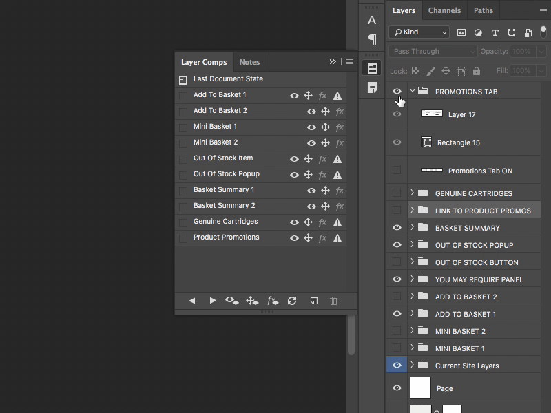

Layer Comps are a great way to quickly show and hide a combination of layers in Photoshop without the need to group all the layers first. This is especially helpful when you need to change the state of layers which are at different positions on the z-axis of the document (the stacking order of layers) meaning the layers cant sit within the same layer group.

Using Layer Comps allows you to organise your layers into a specific state and take a snapshot of that arrangement. You can then change the visibility, position, and even the appearance (Layer Styles) of your layers and use the Layer Comp you saved to return to the previous snapshot whenever you want to.

This is especially useful when designing interfaces which have multiple elements on the screen updating simultaniously, or exploring variations of a particular design. In the gif above the Layer Comps are part of a UI design for an ecommerce checkout flow with a number of different states all living in one PSD file.

Sure the various states can be achieved using [Artboards](https://helpx.adobe.com/photoshop/using/artboards.html) but this creates duplication of layers which leads to an overall larger file size. Layer Comps don't add any extra weight to your file.

## Setting up a Layer Comp

To set up a Layer Comp, first get your Photoshop document into a state you are happy with by setting the visibility and position of your layers.

Open the Layer Comps panel from `Window > Layer Comps` and click on the 'Create New Layer Comp' icon.

Give your comp a name and select which options you want to apply to your layers. You can also add a more descriptive comment which appears in the Layer Comps panel just below the name. Press Save to add your comp to the list.

Now make changes to your document layers to get your document into a new state and save a new Layer Comp.

You can now quickly switch between these document states.

## Conclusion

Layer Comps are by no means a new feature of Photoshop but they are a feature which I've recently fallen in love with again and your should give them a try too for your next UI design project.

Remember though, Layer Comps are not a substitution for well names and well organised layers. But you're doing that already aren't you?!
